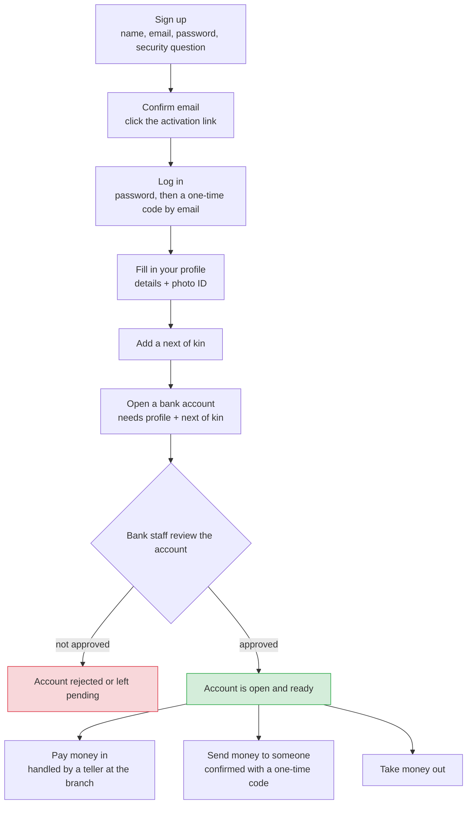

## Application Flow

All endpoints are under `/api/v1`. Auth is cookie-based JWT (`access`/`refresh`);
`CurrentUser` decodes the access cookie and re-validates user status on every request.

### 1. Onboarding (customer)

1. **Register** — `POST /auth/register`
   Email + ID number must be unique. Username is auto-generated, `is_active=False`,
   security question + answer captured here (reused later to authorize transfers).
   An activation email with a signed token is sent.
2. **Activate account** — `GET /auth/activate/{token}`
   Expired token → 410 with a pointer to `POST /auth/resend-activation-link`.
3. **Login (two steps)**
   - `POST /auth/login/request-otp` — email + password. 3 failed attempts lock the
     account for `LOCKOUT_DURATION_MINUTES`; inactive users are rejected. On success
     an OTP is emailed (valid `OTP_EXPIRATION_MINUTES`). Response is always generic.
   - `POST /auth/login/verify-otp` — returns the user and sets access/refresh cookies.
   - Session upkeep: `POST /auth/refresh`, `POST /auth/logout`.
   - Forgot password: `POST /auth/request-password-reset` → `POST /auth/reset-password/{token}`.

### 2. KYC prerequisites

4. **Profile** — `POST /profile/create`, `PATCH /profile/update`, `GET /profile/me`.
   ID images via `POST /profile/upload/{image_type}` (Celery task) polled with
   `POST /profile/upload/{task_id}/status`.
5. **Next of kin** — `POST /next-of-kin/create`, `PATCH`, `DELETE`, `GET /next-of-kin/all`.
   At least one is required.

### 3. Bank account

6. **Create** — `POST /bank-account/create`
   KYC gate: user must have a profile **and** ≥1 next of kin, else 400.
   Max `MAX_BANK_ACCOUNTS` (3) per user; first account becomes primary automatically,
   and only one primary is allowed. Account number is generated per currency.
   Account starts inactive; a confirmation email is sent.
7. **Activate / verify KYC** — `PATCH /bank-account/{account_id}/activate`
   **Account executive only**, and cannot activate their own account. Sets
   `kyc_submitted`/`kyc_verified`, records verifier + timestamp, status → Active.
   Owner gets an activation email.

### 4. Money movement (all require an Active account)

8. **Deposit** — `POST /bank-account/deposit` — **teller only**, at the counter.
   Credits the target account and emails a deposit alert.
9. **Transfer** (two steps, own funds)
   - `POST /bank-account/transfer/initiate` — requires an `idempotency-key` header
     (UUID v4, cached 24h). Checks: not self-transfer, sender account owned + active,
     **security answer matches**, receiver account exists + active, sufficient balance.
     Cross-currency conversion (rate + fee) is computed and stored on the transaction.
     An OTP is emailed to the sender; transaction is left pending.
   - `POST /bank-account/transfer/complete` — reference + OTP. Re-validates balances
     and account status, moves the money, alerts both parties.
10. **Withdrawal** — `POST /bank-account/withdraw` — account number + username +
    `idempotency-key` header. Checks account active and sufficient funds, debits and
    emails a withdrawal alert.

### Roles

`customer` (default), `teller` (deposits), `account_executive` (bank account activation),
`branch_manager` (`GET /profile/all` — list all user profiles), `admin`, `super_admin`.

### Diagram

